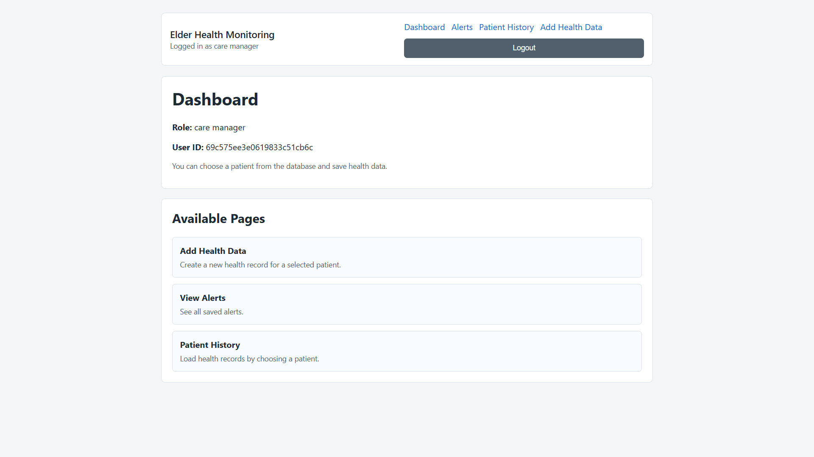
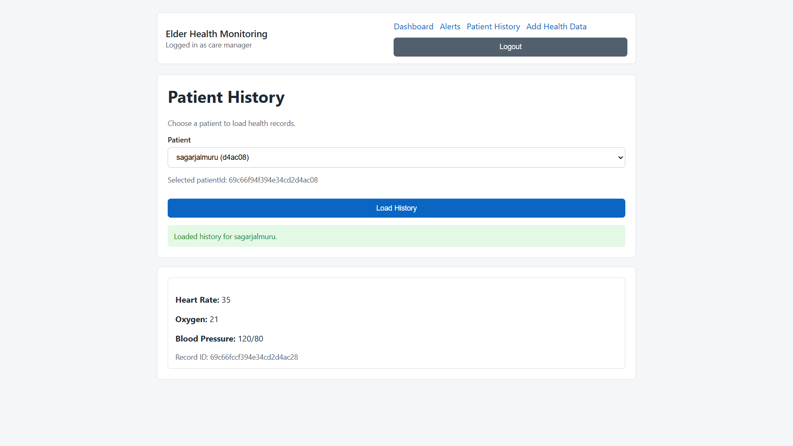
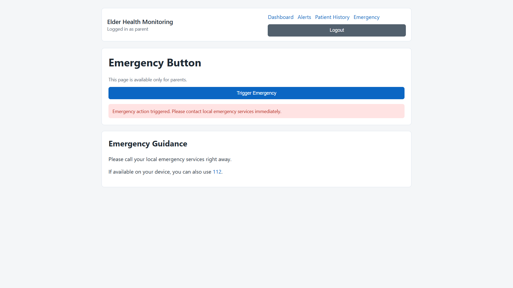

## 🏥 Elder Health Monitoring System

## 📌 Overview
The Elder Health Monitoring System is a full-stack web application designed to assist caregivers in monitoring the health of elderly patients. It enables real-time tracking of vital parameters and provides alerts for abnormal conditions, ensuring timely medical attention.
## 🎯 Objective
To provide a reliable and user-friendly platform for continuous health monitoring and improved patient safety.

## 🚀 Features
- Add and manage patient records
- Monitor vital signs:
  - Heart Rate
  - Blood Pressure
  - Oxygen Level
- Real-time alerts for abnormal conditions
- Caregiver dashboard for centralized monitoring
- Unique Patient ID system
- Handles multiple alerts simultaneously

## 🛠 Tech Stack
- Frontend: HTML, CSS, JavaScript
- Backend: Node.js, Express.js
- Database: MongoDB

## 📂 How to Run
1. Clone the repository:
   git clone https://github.com/Kirtan148/Elder-Health-Monitoring-System.git

2. Navigate to project:
   cd Elder-Health-Monitoring-System

3. Install dependencies:
   npm install

4. Run:
   npm start

5. Open:
   http://localhost:3000

## 🌐 Live Demo
(Add your Render link here)

## 📸 Screenshots

### Dashboard

### Patient History

### Edit Page

🤖 AI Usage
AI tools (ChatGPT) were used only for guidance, debugging, and understanding concepts. The implementation, logic, and testing were done independently.

## 👤 Author
Kirtan
